# 🛒 EcoMarket - Ricardo Vargas

**EcoMarket** es un sitio web responsivo diseñado para simular una tienda en línea enfocada en productos ecológicos y sustentables. El proyecto cuenta con una arquitectura limpia de carpetas y está optimizado para ofrecer una experiencia de usuario fluida tanto en dispositivos móviles como en pantallas de escritorio.

## 🚀 Descripción del Proyecto

Este proyecto es una plataforma web estática que presenta una interfaz moderna para un mercado ecológico. Organiza su contenido de manera estructurada permitiendo navegar entre la página principal y diferentes vistas del catálogo o detalles de productos.

### Estructura del Repositorio
* `index.html`: Punto de entrada principal de la aplicación.
* `css/`: Carpeta que contiene las hojas de estilo para el diseño y la adaptabilidad.
* `img/`: Recursos visuales, logotipos e imágenes de los productos.
* `views/`: Secciones y páginas secundarias del sitio web.

## 🛠️ Tecnologías Utilizadas

El proyecto fue construido utilizando tecnologías web estándar sin dependencias externas pesadas:

* **HTML5**: Estructuración semántica del contenido de la tienda.
* **CSS3**: Estilos personalizados, diseño de interfaz y diseño responsivo (*Media Queries*).

## 💻 Instrucciones de Visualización

Para visualizar y ejecutar este proyecto de forma local, sigue estos sencillos pasos:

1. **Clonar el repositorio:**
   git clone https://github.com/RickDslayer/EcoMarket_RicardoVargas
2. **Navegar a la carpeta del proyecto:**
   cd EcoMarket_RicardoVargas
3. **Abrir el proyecto:**
   * Haz doble clic sobre el archivo `index.html` para abrirlo en tu navegador web predeterminado.
   * Alternativamente, si usas *Visual Studio Code*, puedes hacer clic derecho sobre `index.html` y seleccionar **Open with Live Server** para una visualización en tiempo real.

## 📸 Capturas de Pantalla

### Vista de Escritorio (Desktop)

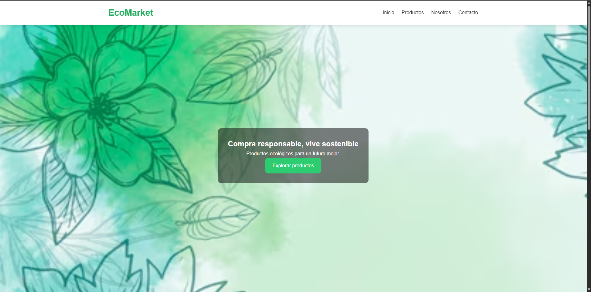
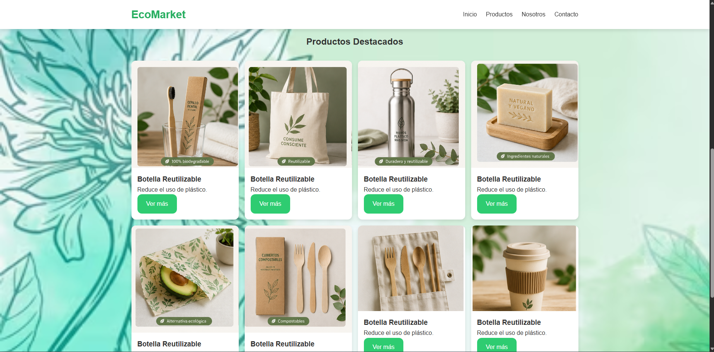
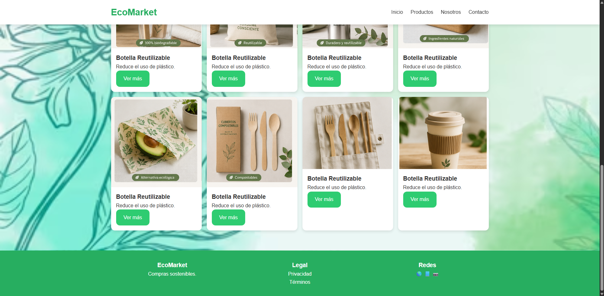
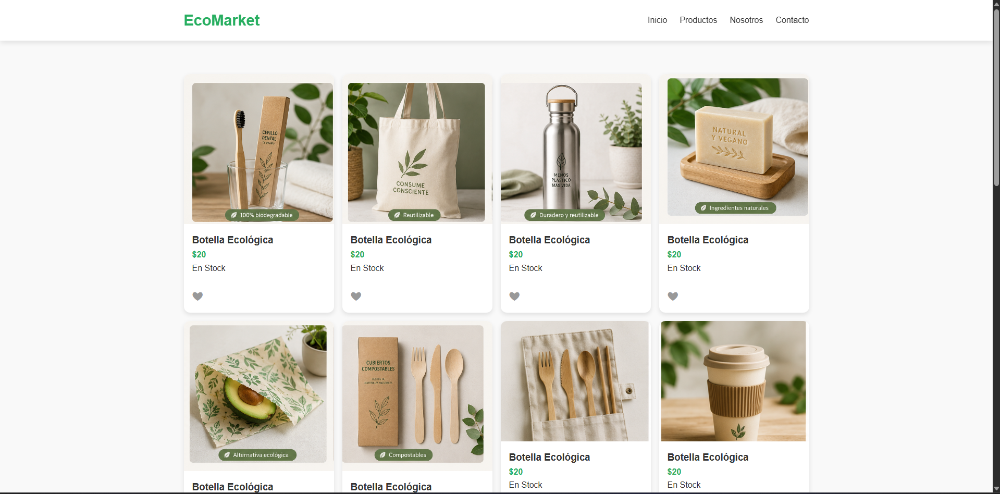
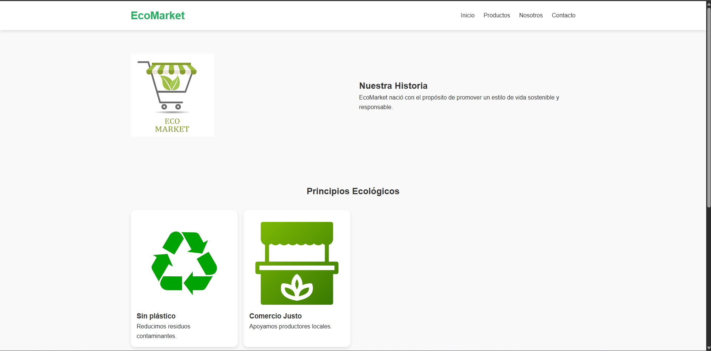
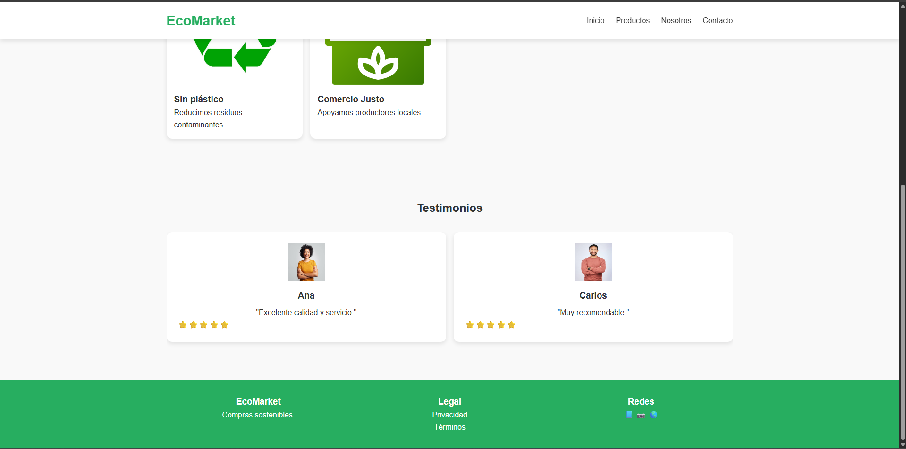
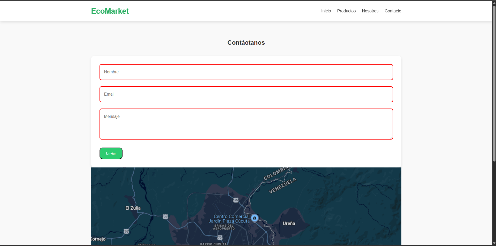
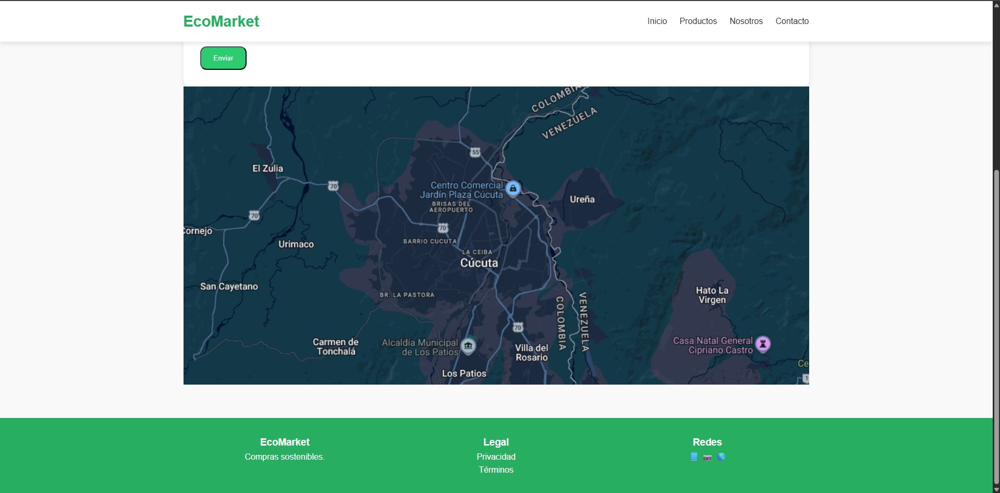

### Vista Móvil (Mobile)

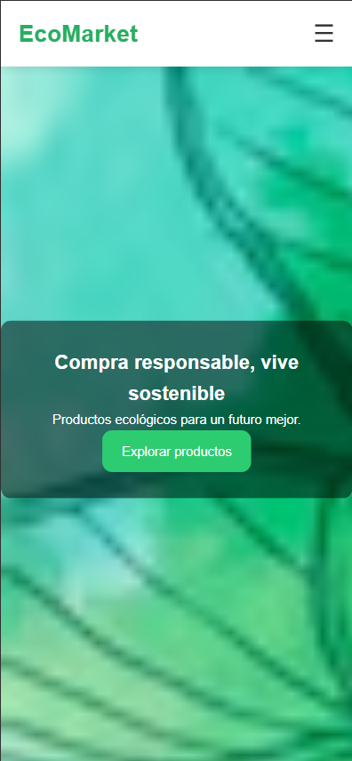
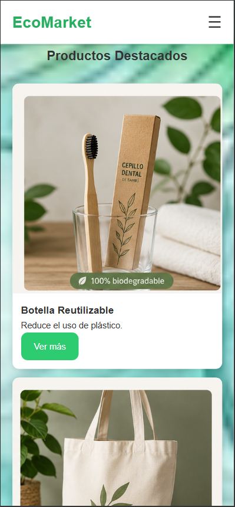
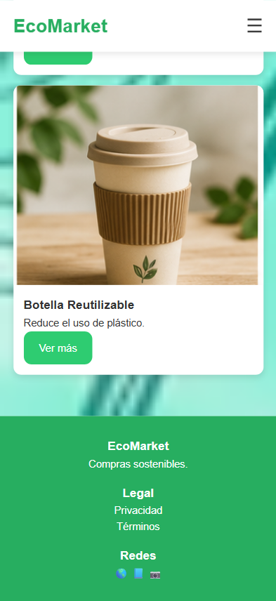
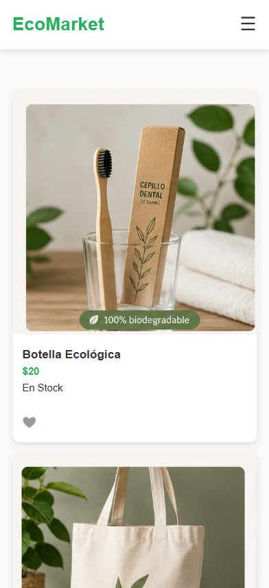
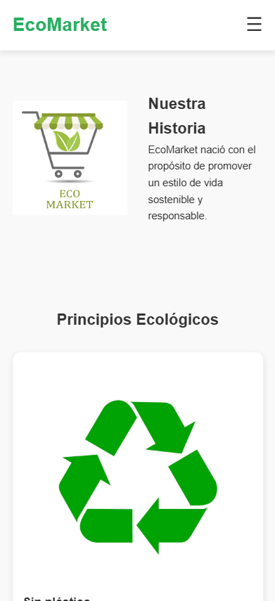
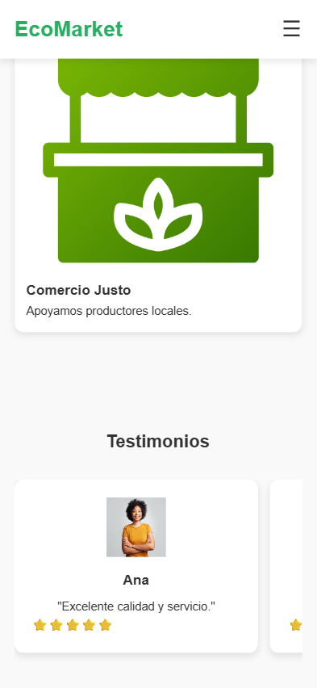
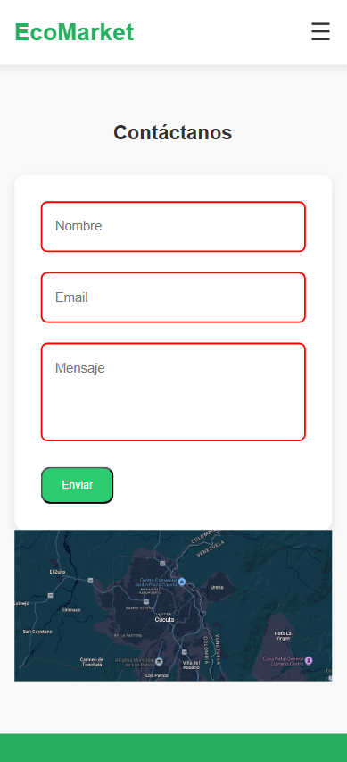